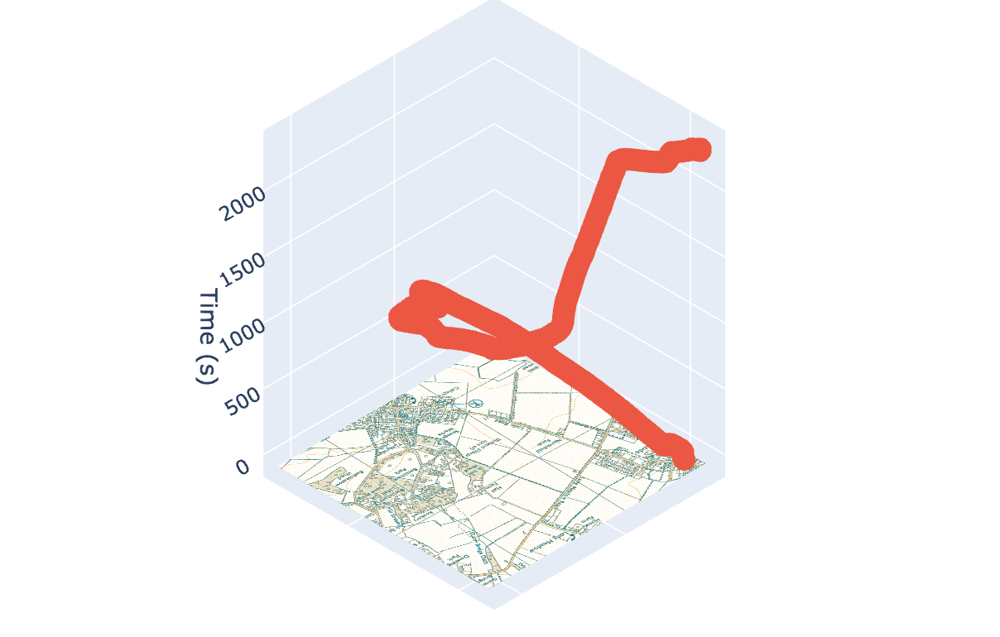
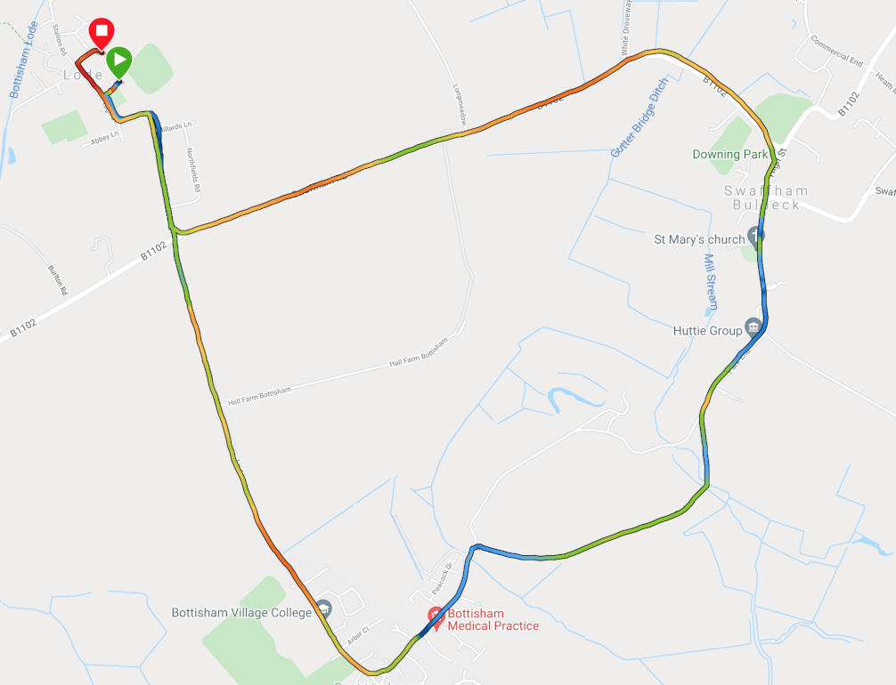

<link rel="stylesheet" href="css/md.css">

## Portfolio

---

### Recent Publications 

- [Robocop, Skynet, and Talking Toasters. Automation, AI, and Augmentation in policing (Policing Insight)](https://policinginsight.com/features/robocop-skynet-and-talking-toasters-automation-ai-and-augmentation-in-policing/)

- [How to Train your AI (TechUK)](https://www.techuk.org/resource/how-to-train-your-ai.html)

- [Analytic Technology Industry Roundtable Study: Analytics and Use Cases (Mitre)](http://www.technologyroundtable.org/pdfs/Analytics_and_Use_Cases_Study_IBM_SAS_11_25_16.pdf)

---
[Data Cube Visualisation](/pages/datacube.md)

Experiment with 3 dimensions, the following Jupyter example takes the gps output from my [Garmin Vivosport](https://support.garmin.com/en-US/?identifier=563441244&tab=topics) and an Ordnance Survey basemap plotting latitude and longitude on the (x,y) and time on the z axis. I compare this to the standard Garmin Connect output which using 2 dimensions highlights pace a a colour map [green to red]  

| 3D Visualisation            | 2D Visualisation        |
| :-----------:               | :-----------: |

|       |        |

---

